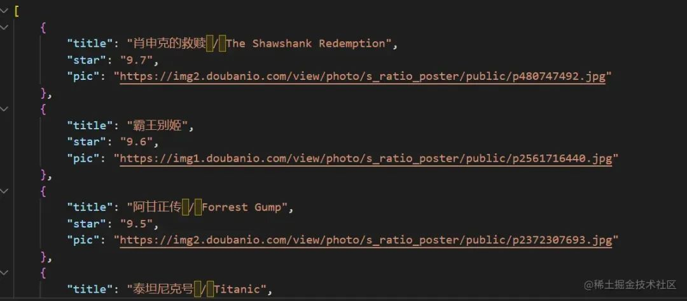

# 用node写一个爬虫，超简单

# 前言

你是否有一个想法，自己设计一个网站，然后去爬取别人家页面的数据来做一个自己的网站。哈哈哈，如果自己写着玩可能没啥事，但如果用这个网站来获利，你可能就要被寄律师函了，毕竟这有点‘刑’。这篇文章呢，就带大家爬取豆瓣TOP250电影的信息。豆瓣电影 Top 250 (douban.com)


# 准备工作

通过指令 `npm init` 初始化文件夹，会获得 `package.json` 项目说明书。

爬虫必备工具： `cheerio` ；通过在终端输入 `npm i cheerio` ，即可将文件装到项目里。 `cheerio` 是 `jquery` 核心功能的一个快速灵活而又简洁的实现，主要是为了用在服务器端需要对 `DOM` 进行操作的地方。大家可以简单的理解为用来解析 `html` 非常方便的工具。

# 开始(细分七步)
1. 用`https`模块(`node`直接提供给我们的)获取网站地址，通过get方法读取网站地址上的数据。

```js
const https = require('https')
https.get('https://movie.douban.com/top250', function(res) {
            let html = ''
            res.on('data', function(chunk) {
                //console.log(chunk + '');
                //得到数据流，通过字符串拼接得到html结构
                html += chunk
            })
```

这样会读取到整个页面的html结构。

2. 通过 `res.on('end', function () {})`，保证读取完了才会去做操作。

3. 引入cheerio

```js
const cheerio = require('cheerio')
```

4. 获取html中的数据

```js
const $ = cheerio.load(html)
$('li .item').each(function() {
    const title = $('.title', this).text()
    const star = $('.info .bd .rating_num', this).text()
    const pic = $('.pic img', this).attr('src')
})
```

这里需要注意的是我们可以去页面上看我们需要拿到哪个类名里面的内容，通过$符号可以拿到内容。


5. 创建一个空数组，把数据以对象的形式存放在数组中

```js
let allFiles = []
allFiles.push({
    title: title,
    star: star,
    pic: pic
})
```

我们可以通过 `console.log(allFiles)` 来检查是否打印出来了我们需要的结果。

6. 将数据写入文件，引用`node`官方提供的模块`fs`

```js
const fs = require('fs')
```

创建文件夹 `files.json` ，向其中写入数据

```js
fs.writeFile('./files.json', JSON.stringify(allFiles), function(err, data) {
    if (err) {
        throw err
    }
    console.log('文件保存成功');
})
```

到这之后，我们可以看到在当前文件夹下自动创建了文件 `files.json` ，里面已经有了我们想要的数据。



# 完整代码

```js
//引入模块
const https = require('https')
const cheerio = require('cheerio')
const fs = require('fs')
//获取页面的html结构
https.get('https://movie.douban.com/top250?start=25', function(res) {
    let html = ''
    res.on('data', function(chunk) {
        //console.log(chunk + '');
        html += chunk
    })
    res.on('end', function() {
        // 获取html中的数据
        const $ = cheerio.load(html)
        let allFiles = []
        //拿到每一个item中我们需要的数据
        $('li .item').each(function() {
            const title = $('.title', this).text()
            const star = $('.info .bd .rating_num', this).text()
            const pic = $('.pic img', this).attr('src')
            //数据以对象的形式存放在数组中
            allFiles.push({
                title: title,
                star: star,
                pic: pic
            })
        })
        //console.log(allFiles);
        //将数据写入文件中
        fs.writeFile('./files2.json', JSON.stringify(allFiles), function(err, data) {
            if (err) {
                throw err
            }
            console.log('文件保存成功');
        })
    })
})
```

# 结语

到这里你会发现node的爬虫写起来不是很难的，作为一名前端新手我们应该知道node它是非常强大的，它能读得懂js可以用来做后端开发。本文的实现是爬取一些简单的数据，是一个入门，希望对未来学习node有帮助。
